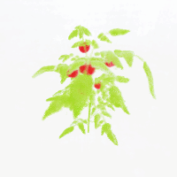
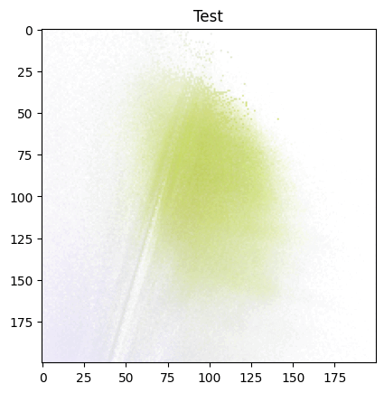

# 👋 Hi there, I'm Geonwoo Kim (김건우)

🎓 Recent graduate from the University of Illinois at Urbana-Champaign  
🔧 B.S. in Mechanical Engineering
🔬 Currently undergraduate researcher in [Advanced Control Research Lab](https://naira.mechse.illinois.edu/)

---

## 💡 About Me

I’m an engineer and researcher driven by a deep interest in intelligent systems, autonomy, and software innovation. My academic and hands-on experiences span across robotics, machine learning, and embedded programming—equipping me with a multidisciplinary foundation to design, build, and deploy robust, real-world solutions.

I enjoy working at the intersection of algorithms, software, and hardware, and have contributed to projects involving:

**Robotics and Autonomy**, including motion planning, control systems, and path optimization

**Software Development** for real-time systems and simulation environments

**Machine Learning & Perception**, with a focus on learning-based navigation and 3D reconstruction

**Sensor Integration and Sensor Fusion** using tools like Lidar, cameras, and UWB

**Embedded Systems** using microcontrollers and IoT

**System Integration** across ROS-based platforms and hardware-in-the-loop experiments

From simulating obstacle-aware trajectories to deploying embedded controllers for real-world robots, I thrive at the intersection of mechanical design and intelligent control.

---

<h3 align="left">Languages and Tools:</h3>

                    

---

## 📁 Projects

### Time Varing Model Predictive Control for Real-Time Planning in Dynamic Environments (In Progress)

TBD, Credential before the Submission

### [Autonomous Tracking Gym Robot](https://github.com/geonwoo3/gymbot_ros)

A mobile robot designed to autonomously follow users in indoor gym environments by combining Ultra-Wideband (UWB) positioning with LiDAR-based obstacle avoidance. Built using ROS, the system integrates real-time localization, trajectory planning, and motor control to enable safe, smooth, and responsive tracking in cluttered indoor spaces.

📡 UWB-based real-time user tracking

🧭 LiDAR-assisted dynamic obstacle avoidance

🔧 ROS-powered architecture with modular control nodes

⚙️ Hardware: ESP32 UWB, RPLiDAR, Raspberry Pi, DC motor chassis

### [3D Visualization of Fruits using NeRF for Smart Farms](https://github.com/ggannuuu/NeRF_SmartFarm)

<figure>
  
  <figcaption align="center"><b>NeRF-Based 3D Reconstruction of Tomato Plant</b></figcaption>
</figure>

<figure>
  
  <figcaption align="center"><b>Convergence of NeRF over 50 Epochs</b></figcaption>
</figure>

This project applies Neural Radiance Fields (NeRF) to reconstruct high-fidelity 3D models of fruits from 2D images, enabling advanced perception in smart agriculture systems. Trained on the Blender dataset and optimized for custom fruit datasets, the model generates novel views and supports precision farming applications.

🧠 NeRF implemented in PyTorch with positional encoding

🍎 Enables 3D understanding of fruit shapes for harvesting and monitoring

🖼️ Trained on multi-view synthetic and real-world datasets

🎥 Includes rendering animations and camera path interpolation tools

### [Test Frame Full-stack Lab Software](https://github.com/ggannuuu/Test-Frame)

A complete software suite for controlling and collecting data from a custom material testing frame.

- 🖥️ Front-end: PyQt5-based GUI for real-time interaction and visualization

- 🧠 Back-end: Python-based computation for stress, strain, and data handling

- ⚙️ Hardware Control: Arduino C++ code for precise test frame actuation

- 📊 Key Features:

  - Multiple testing modes: Continuous, Manual, Timer

  - Real-time force-time plotting and terminal feedback

  - Emergency stop, auto-zeroing, and CSV data export

- 🎯 Designed For: Material testing experiments in academic or research settings

- [▶️ Watch Demo on YouTube](https://www.youtube.com/watch?v=66HWL49Xx-E)

### [Thermal Camera Synchronization](https://github.com/tag-nav/flir_boson_pub)

Contributed to a research project focused on synchronizing FLIR thermal cameras with external triggers for time-aligned image capture in robotics experiments. My role included:

🔧 Hardware Integration: Configured FLIR Boson and auxiliary cameras for synchronized frame capture using external GPIO triggers

🖥️ Software Development: Developed Python scripts using the FLIR Boson SDK to automate image acquisition and timestamp alignment

⏱️ Signal Timing Optimization: Calibrated trigger delays and validated frame synchronization accuracy across devices

📊 Application: Enabled reliable thermal data collection for robot perception and multi-sensor fusion in dynamic environments

---

## 🔬 Research Experience

### 🤖 Autonomous Systems & Robotics
- Developed simulation environments for **real-time MPC** and **L1 Adaptive Optimization**  
- Implemented dynamic obstacle management using Python and ROS  
- Integrated UWB and Lidar sensing for real-time localization and environment mapping  

### ⚙️ Controls & Mechatronics
- Designed a **tensile test system** with load cell feedback and motor control  
- Built interfaces for real-time experimentation and visualization  
- Applied control theory for practical automation tasks in research labs  

---

## 🧰 Technical Skills

**Programming Languages:** Python, C++, C, Java, JavaScript, CSS, HTML, Typescript MATLAB, ROS, Linux, Bash, 
**AI & ML:** TensorFlow, PyTorch, pandas, OpenCV, scikit_learn
**Embedded & Hardware:** Dynamixel Motors, Lidar, Raspberry Pi, UWB (DW3000), Arduino, SLAM
**Tools:** SolidWorks, Fusion 360, LTSpice, LabVIEW, Simulink, 
**Workflow:** Git, GitHub, VSCode, Docker, LaTeX  

---

## 📌 Current Focus

- Enhancing time-varying optimization frameworks for adaptive planning  
- Integrating **CrazySwarm** and multi-robot systems in ROS  
- Publishing ongoing research on dynamic environment control strategies  

---

## 📫 Get in Touch

- 💼 [LinkedIn](https://www.linkedin.com/in/geonwoo-kim)  
- 📧 ggannuuu@gmail.com  
- 🌐 [Personal Website](https://ggannuuu.com)

---

Thanks for visiting! Let's build robots that adapt, learn, and move smartly 🚀
