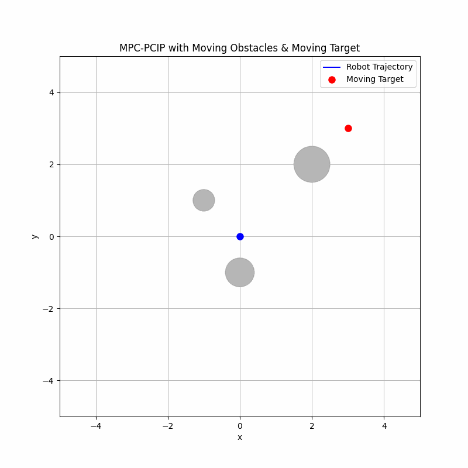
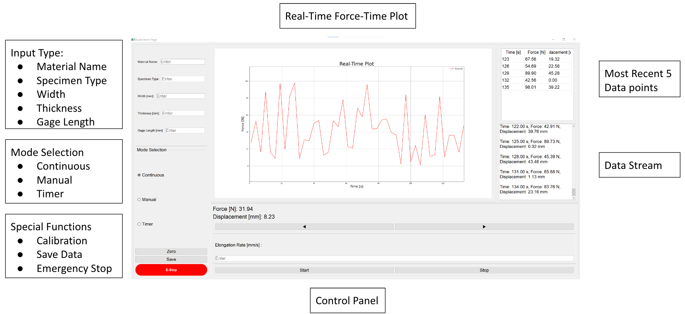

# 👋 Hi there, I'm Geonwoo Kim (김건우)

🎓 Recent graduate from the University of Illinois at Urbana-Champaign  
🔧 B.S. in Mechanical Engineering
🔬 Undergraduate researcher in robotics, autonomous systems, and control  

---

## 💡 About Me

I’m passionate about building intelligent robotic systems that navigate dynamic environments. My academic journey and hands-on research have centered around:

- **Motion Planning** and **Model Predictive Control (MPC)**
- **L1 Adaptive Control** and real-time optimization
- **Sensor Fusion** using Lidar and Ultra-Wideband (UWB)
- **Dynamic Obstacle Avoidance** in simulation and hardware
- **Embedded Systems** with Arduino, ESP32, and Raspberry Pi
- **Autonomous Driving Algorithms** and path prediction

From simulating obstacle-aware trajectories to deploying embedded controllers for real-world robots, I thrive at the intersection of mechanical design and intelligent control.

---

## 📁 Projects

### Time Varing Model Predictive Control for Real-Time Planning in Dynamic Environments (In Progress)

TBD, Credential before the Submission

### [Autonomous Tracking Gym Robot](https://github.com/geonwoo3/gymbot_ros)

A mobile robot designed to autonomously follow users in indoor gym environments by combining Ultra-Wideband (UWB) positioning with LiDAR-based obstacle avoidance. Built using ROS, the system integrates real-time localization, trajectory planning, and motor control to enable safe, smooth, and responsive tracking in cluttered indoor spaces.

📡 UWB-based real-time user tracking

🧭 LiDAR-assisted dynamic obstacle avoidance

🔧 ROS-powered architecture with modular control nodes

⚙️ Hardware: ESP32 UWB, RPLiDAR, Raspberry Pi, DC motor chassis

### [3D Visualization of Fruits using NeRF for Smart Farms](https://github.com/ggannuuu/NeRF_SmartFarm)

This project applies Neural Radiance Fields (NeRF) to reconstruct high-fidelity 3D models of fruits from 2D images, enabling advanced perception in smart agriculture systems. Trained on the Blender dataset and optimized for custom fruit datasets, the model generates novel views and supports precision farming applications.

🧠 NeRF implemented in PyTorch with positional encoding

🍎 Enables 3D understanding of fruit shapes for harvesting and monitoring

🖼️ Trained on multi-view synthetic and real-world datasets

🎥 Includes rendering animations and camera path interpolation tools

### [Test Frame Full-stack Lab Software](https://github.com/ggannuuu/Test-Frame)

A complete software suite for controlling and collecting data from a custom material testing frame.

- 🖥️ Front-end: PyQt5-based GUI for real-time interaction and visualization

- 🧠 Back-end: Python-based computation for stress, strain, and data handling

- ⚙️ Hardware Control: Arduino C++ code for precise test frame actuation

- 📊 Key Features:

  - Multiple testing modes: Continuous, Manual, Timer

  - Real-time force-time plotting and terminal feedback

  - Emergency stop, auto-zeroing, and CSV data export

- 🎯 Designed For: Material testing experiments in academic or research settings

- [▶️ Watch Demo on YouTube](https://www.youtube.com/watch?v=66HWL49Xx-E)

### Thermal Camera Synchronization

---

## 🔬 Research Experience

### 🤖 Autonomous Systems & Robotics
- Developed simulation environments for **real-time MPC** and **L1 Adaptive Optimization**  
- Implemented dynamic obstacle management using Python and ROS  
- Integrated UWB and Lidar sensing for real-time localization and environment mapping  

### ⚙️ Controls & Mechatronics
- Designed a **tensile test system** with load cell feedback and motor control  
- Built interfaces for real-time experimentation and visualization  
- Applied control theory for practical automation tasks in research labs  

---

## 🧰 Technical Skills

**Programming:** Python, C++, JavaScript, MATLAB, ROS, Arduino  
**Simulation:** NumPy, OpenCV, Matplotlib, Trimesh, ECOS Solver  
**Embedded & Hardware:** Dynamixel Motors, UWB (DW3000), RPLidar, Raspberry Pi  
**Tools:** SolidWorks, Fusion 360, LTSpice, LabVIEW  
**Workflow:** Git, GitHub, VSCode, LaTeX  

---

## 📌 Current Focus

- Enhancing time-varying optimization frameworks for adaptive planning  
- Integrating **CrazySwarm** and multi-robot systems in ROS  
- Publishing ongoing research on dynamic environment control strategies  

---

## 📫 Get in Touch

- 💼 [LinkedIn](https://www.linkedin.com/in/geonwoo-kim)  
- 📧 ggannuuu@gmail.com  
- 🌐 [Personal Website](https://ggannuuu.com)

---

Thanks for visiting! Let's build robots that adapt, learn, and move smartly 🚀
